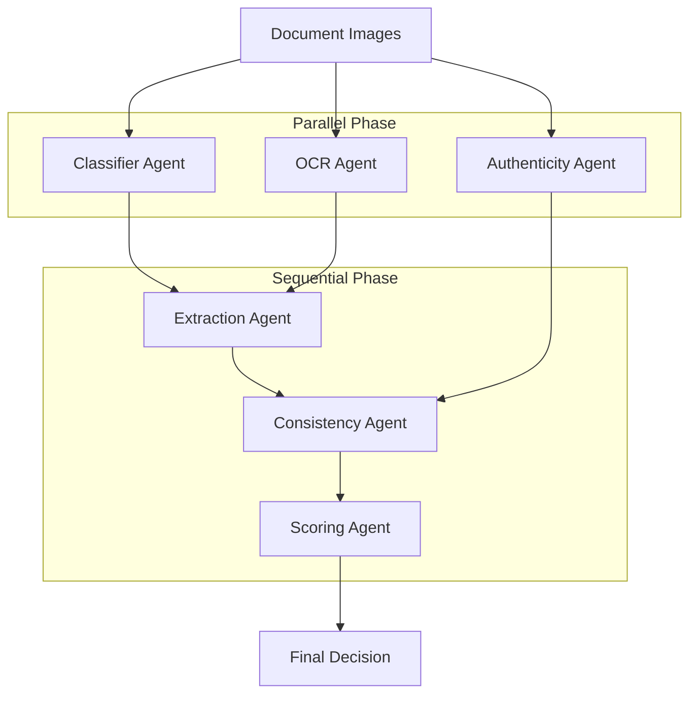
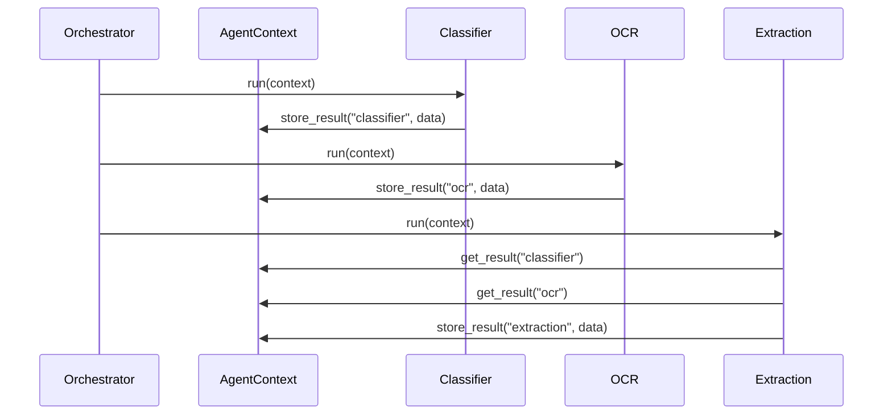

# Corsairs-Bejaia: Scraping & AI Verification Service

[](https://fastapi.tiangolo.com/)
[](https://ai.google.dev/)
[](https://playwright.dev/)
[](https://www.docker.com/)

> **High-fidelity automated document verification for the Algerian market.** Combining sophisticated agentic AI orchestration with robust government portal automation.

---

## Overview

This monorepo powers a high-integrity document verification pipeline. It is designed to replace manual review with a 6-Agent Autonomous System that classifies, extracts, and validates documents while detecting fraud and cross-referencing government data (CNAS).

---

## System Design: Agentic Architecture

The system follows a centralized **Orchestrator Pattern**. The `AgentOrchestrator` manages the lifecycle of 6 specialized agents, handling state via a shared `AgentContext`.

### 1. High-Level Process Flow

The pipeline is split into a parallel execution phase for I/O-bound tasks and a sequential phase for analytical reasoning.



### 2. Internal Agent Communication

Agents do not communicate directly. Instead, they write to and read from a shared **AgentContext**. This ensures loose coupling and allows for easy auditing of the "trace" at any step.



### 3. Self-Correction Loop

The Extraction and OCR agents utilize a feedback loop. If the initial tool (e.g., Tesseract) returns a confidence score below a specified threshold, the agent automatically invokes a higher-tier tool (e.g., Gemini Vision) with a specific recovery prompt.

---

## Service Specifications

### 1. AI Service (ai-service) - Port 8000

*   **Classifier Agent**: Multi-strategy identification using keyword patterns, visual similarity, and LLM-vision fallback.
*   **OCR Agent**: Adaptive engine selection (PaddleOCR / Tesseract / Gemini) based on estimated image quality (Laplacian variance).
*   **Extraction Agent**: Template-aware field parsing with automated retry logic for missing required fields.
*   **Authenticity Agent**: Parallel CV analysis including Stamp detection, Signature complexity check, and Error Level Analysis (ELA).
*   **Consistency Agent**: Cross-document validation with token-set fuzzy matching for Arabic/French name transliteration.
*   **Scoring Agent**: Deterministic tiered judge that assigns a Trust Score (0-100) based on Identity, Employment, Credentials, and Integrity.

### 2. Scraping Service (scraping-service) - Port 8002

*   **Portal Automation**: Stateless Playwright workers for CNAS portal interaction.
*   **OCR-Driven Bypass**: Integrated multi-thresholding CAPTCHA solver.
*   **Resource Management**: Built-in browser pooling and rate limiting for stability.

---

## Tech Stack

*   **Backend**: Python 3.13, FastAPI, Pydantic V2
*   **AI/CV**: Google Gemini (Vertex AI), OpenCV, PaddleOCR, Tesseract
*   **Automation**: Playwright, uv (Dependency Management)
*   **Infrastructure**: Docker, MinIO (Document Storage)

---

## Installation & Setup

### Prerequisites
* [uv](https://github.com/astral-sh/uv) - Modern Python package manager
* Tesseract OCR & System Libs
  ```bash
  sudo apt update && sudo apt install tesseract-ocr libgl1 libglib2.0-0
  ```

### Local Setup
```bash
# Sync dependencies
uv sync

# Configure environment
cp .env.example .env

# Run services
cd ai-service && uv run uvicorn app.main:app --port 8000 --reload
cd ../scraping-service && uv run uvicorn app.main:app --port 8002 --reload
```

---

## Production Features

*   **SSE Pipeline Streaming**: Provides real-time updates to frontend clients as agents complete their tasks.
*   **Operational Health Checks**: Real-time monitoring of external dependencies (CNAS, Gemini).
*   **Audit Traces**: Every verification includes a micro-log of tool execution and confidence metrics.
*   **Concurrency**: Parallel execution of agents reduces end-to-end latency significantly.

---
Corsairs-Bejaia Verification Monorepo - 2026 Hackathon.
