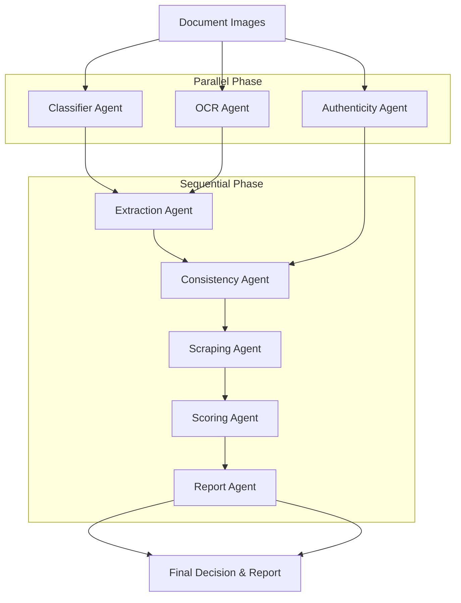
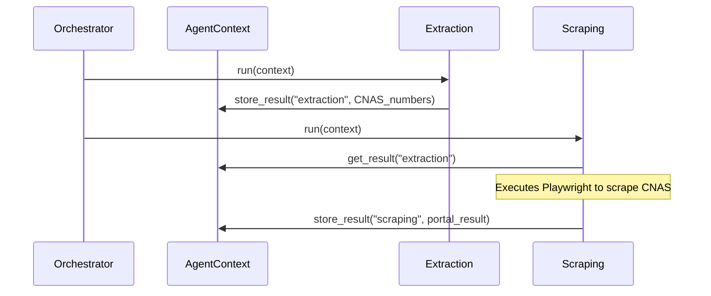

# Corsairs-Bejaia: AI Verification Service

[](https://fastapi.tiangolo.com/)
[](https://ai.google.dev/)
[](https://playwright.dev/)
[](https://www.docker.com/)

> **High-fidelity automated document verification for the Algerian market.** Combining sophisticated agentic AI orchestration with robust government portal automation natively in a single microservice.

---

## Overview

This repository powers a high-integrity document verification pipeline. It is designed to replace manual review with a **7-Agent Autonomous System** that classifies, extracts, and validates documents while detecting fraud, cross-referencing government data (CNAS) via web scraping, and generating professional reports.

---

## System Design: Agentic Architecture

The system follows a centralized **Orchestrator Pattern**. The `AgentOrchestrator` manages the lifecycle of 7 specialized agents, handling state via a shared `AgentContext`.

### 1. High-Level Process Flow

The pipeline is split into a parallel execution phase for I/O-bound tasks and a sequential phase for analytical reasoning and web automation.



### The 7 Autonomous Agents

1.  **Classifier Agent**: Examines incoming images and determines the exact document type (e.g., National ID, Medical Diploma, CNAS Attestation) using visual similarity and LLM fallback.
2.  **OCR Agent**: Scans the images and converts pixels to text. It adapts its strategy on the fly (PaddleOCR vs Tesseract vs Gemini Vision) depending on the blurriness and quality of the scan.
3.  **Extraction Agent**: Takes the raw text from the OCR Agent and maps it to structured JSON templates (e.g., pulling out just the `attestation_number` and `employer_id` from a noisy page).
4.  **Authenticity Agent**: The forensic expert. It runs parallel computer-vision checks on the image to detect photoshopped pixels (ELA analysis), fake stamps, forged signatures, and AI generation artifacts (DALL-E/Midjourney).
5.  **Consistency Agent**: Acts as the cross-referencer. It takes the structured data from all uploaded documents and ensures they belong to the same person (e.g., fuzzy-matching Arabic and French transliterations of the doctor's name across their ID and Diploma).
6.  **Scraping Agent**: The web automation bot. If a CNAS document is detected, it spins up a headless browser, solves government CAPTCHAs, logs into `elhanaa.cnas.dz`, and verifies the extracted employer numbers against the live database.
7.  **Scoring & Report Agents**: The Scoring Agent takes all the findings, applies a configurable `trust_threshold`, and issues a final `approved`/`review`/`rejected` decision. The Report Agent then compiles the entire journey into a professional, human-readable Markdown report for the dashboard.

### 2. Internal Agent Communication

Agents do not communicate directly. Instead, they write to and read from a shared **AgentContext**. This ensures loose coupling and allows for easy auditing of the "trace" at any step.



### 3. Self-Correction Loop

The Extraction, OCR, and Scraping agents utilize feedback loops. If the initial tool (e.g., Tesseract) fails or returns a low confidence score, the agent automatically invokes a higher-tier tool (e.g., Gemini Vision) with a specific recovery prompt.

---

## Tech Stack

*   **Backend**: Python 3.13, FastAPI, Pydantic V2
*   **AI/CV**: Google Gemini (Vertex AI), OpenCV, PaddleOCR, Tesseract
*   **Automation**: Playwright, BeautifulSoup4
*   **Dependency Management**: uv

---

## Installation & Setup

### Prerequisites
* [uv](https://github.com/astral-sh/uv) - Modern Python package manager
* Tesseract OCR & System Libs
  ```bash
  sudo apt update && sudo apt install tesseract-ocr libgl1 libglib2.0-0
  ```

### Local Setup
```bash
# Enter directory
cd ai-service

# Sync dependencies and install Playwright browsers
uv sync
uv run playwright install chromium

# Configure environment
cp .env.example .env

# Run the single integrated service
uv run uvicorn app.main:app --port 8000 --reload
```

---

## Production Features

*   **SSE Pipeline Streaming**: Provides real-time updates to frontend clients as agents complete their tasks, including live progress bars for scraping.
*   **Dynamic Decision Thresholds**: Pass `trust_threshold` dynamically per-request.
*   **Operational Health Checks**: Real-time monitoring of external dependencies (CNAS, Gemini).
*   **Audit Traces**: Every verification includes a micro-log of tool execution and confidence metrics.
*   **Concurrency**: Parallel execution of agents reduces end-to-end latency significantly.

---
Corsairs-Bejaia Verification Service - 2026 Hackathon.
