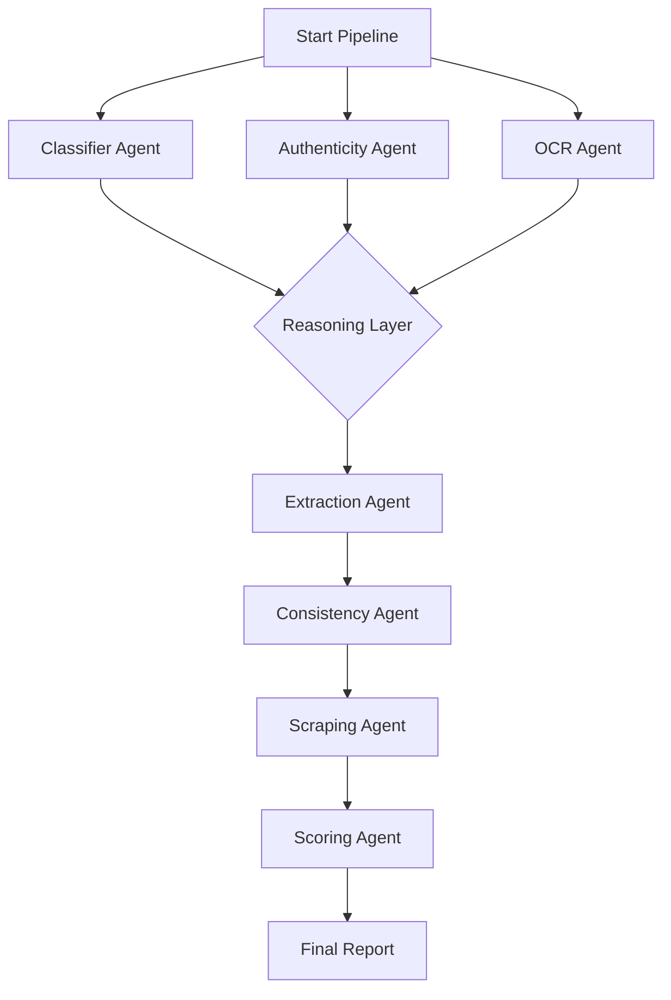

# Agentic System Design

The core of our platform is a **Reasoning-Based Agentic Architecture**. Unlike traditional automation that follows a rigid decision tree, our system uses intelligent agents that can adapt, self-correct, and collaborate to solve complex verification tasks.

## Design Philosophy

The system is built on three pillars of agentic design:

1. **Autonomy with Constraints**: Each agent is an expert in its domain (e.g., Authenticity, Scraping) and has the autonomy to choose which tools to use, but its output is strictly validated against schemas.
2. **Dynamic Feedback Loops**: Agents can perform "Self-Correction". If an initial attempt at a task (like OCR) results in low confidence, the agent triggers a fallback or a more powerful tool automatically.
3. **Traceability**: Every "thought" and "action" taken by an agent is recorded in a chronological trace, providing 100% explainability for every decision.

## The Multi-Agent Orchestration

Our system utilizes a **Synchronous Orchestrator** pattern where agents work in a specific, yet flexible, lifecycle:

### Agent Roles and Responsibilities

* **Classifier Agent**: Determines the document type (e.g., National ID, University Diploma) to set the context for other agents.
* **OCR Agent**: Utilizes a tiered approach (Tesseract -> Gemini Vision) to extract raw text with maximum accuracy.
* **Authenticity Agent**: Performs forensic analysis (ELA, Metadata, AI Detection) to identify forgeries.
* **Extraction Agent**: Transforms raw text into structured JSON based on the document type.
* **Consistency Agent**: Cross-references data between multiple documents (e.g., ensuring the name on the ID matches the Diploma).
* **Scraping Agent**: Acts as a "Human Proxy" to verify data against live government databases like CNAS.
* **Scoring Agent**: Aggregates all findings into a final trust score and a detailed justification.

## The ReAct Pattern (Reasoning and Acting)

Each agent follows a specialized ReAct loop for its internal logic:

1. **Thought**: The agent analyzes the `AgentContext` to determine what is missing.
2. **Action**: The agent selects and executes a `Tool` (e.g., `GeminiVisionTool`).
3. **Observation**: The agent evaluates the tool output.
4. **Correction**: If the observation is poor (e.g., confidence < 70%), the agent loops back to "Thought" to try a different approach.

## Benefits of this Design

* **Zero-Failure Tolerance**: The system handles edge cases (blurry images, weird layouts) through agentic retries.
* **Explainable AI**: Every rejection comes with a clear reason derived from the agentic trace.
* **Rapid Iteration**: New verification rules can be added as new tools for existing agents, requiring no changes to the main application logic.
