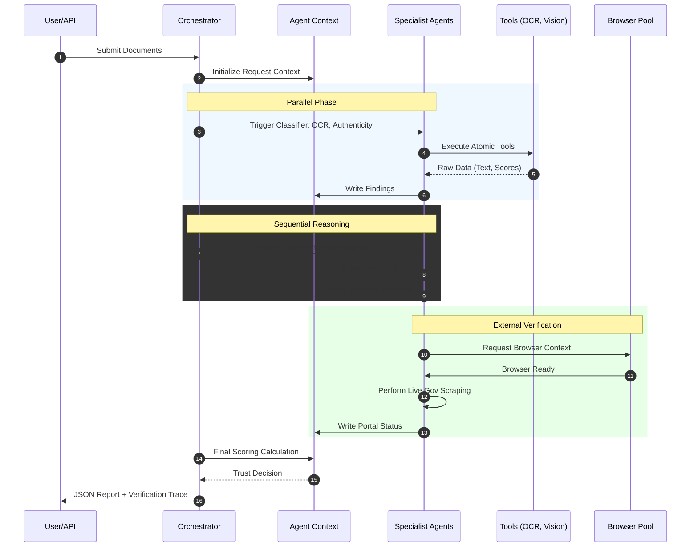

# Components and Interactions

This document details how the software components collaborate to fulfill a doctor verification request.

## Interaction Sequence

## Component Responsibility Matrix

| Component | Responsibility | Interaction Pattern |
| :--- | :--- | :--- |
| **AgentOrchestrator** | Orchestrates the full pipeline lifecycle and manages thread safety. | **Caller**: Primary entry point. |
| **AgentContext** | The ephemeral shared data store for a single verification session. | **State Store**: Centralized memory. |
| **BaseAgent** | Core logic interface for all specialized agents (OCR, Scraping, etc.). | **Contract**: Domain logic executor. |
| **BaseTool** | Atomic unit of work (e.g., Tesseract OCR, Gemini Vision, ELA analysis). | **Worker**: Executed by agents. |
| **BrowserPool** | Manages a thread-safe pool of headless Playwright instances. | **Resource**: Managed service. |
