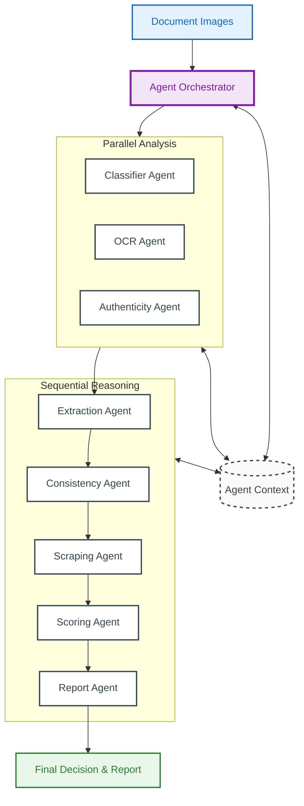

# System Architecture Diagram

This diagram represents the logical and technical flow of data through the 7-agent verification pipeline.

## Phase Breakdown

### Parallel Analysis
I/O-bound and compute-heavy tasks that run concurrently to reduce total processing time. This phase focuses on raw data gathering:
* **Classification**: Identifying the document type.
* **OCR**: Extracting raw text layers.
* **Authenticity**: Running forensic forgery detection.

### Sequential Reasoning
Tasks that require cross-agent intelligence and dependent data:
* **Extraction**: Mapping text to specific medical fields.
* **Consistency**: Cross-referencing data points between documents.
* **Scraping**: Automated verification against live government portals (CNAS/CASNOS).
* **Scoring**: Final risk calculation and trust assignment.
