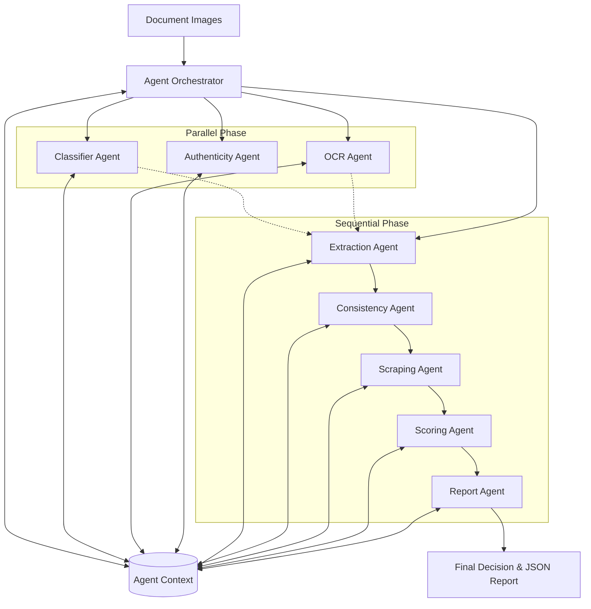

# System Architecture Diagram

This diagram represents the flow of data through the 7-agent pipeline.

## Phase Breakdown

- **Parallel Phase**: I/O-bound and compute-heavy tasks that don't depend on each other (Classification, OCR, Forgery Detection).
- **Sequential Phase**: Reasoning tasks where results from previous agents are required (e.g., Scraping needs the ID number extracted by the Extraction Agent).
