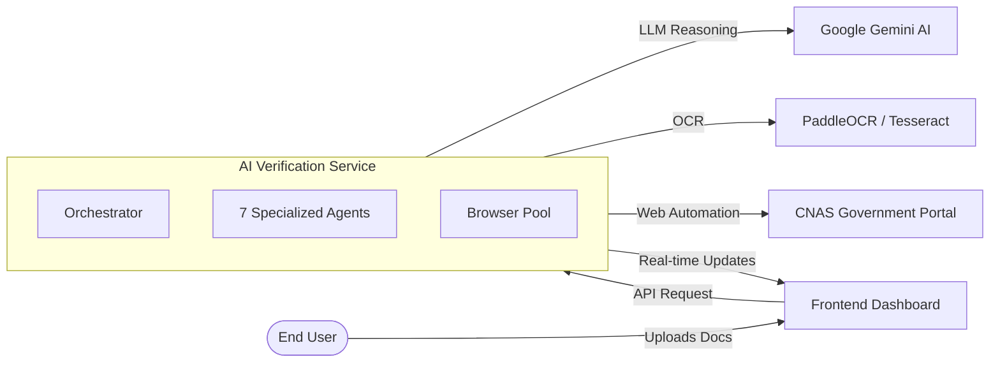
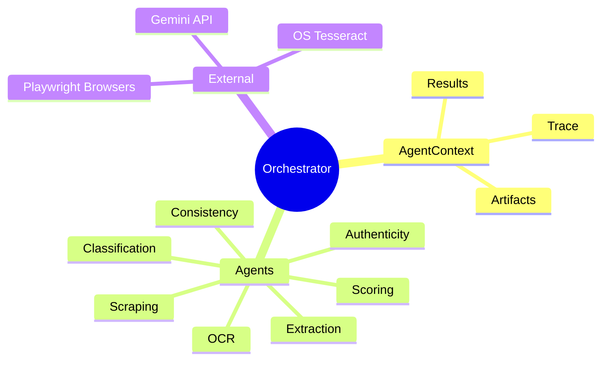

# Visual Representation of the System

This document provides a simplified visual view of how the system sits within the broader ecosystem.

## High-Level Block Diagram

## Internal Interaction Model

The system uses a **Centralized Shared State** model. This is more resilient than a chain-link pipeline because agents can revisit previous decisions if new information becomes available.

