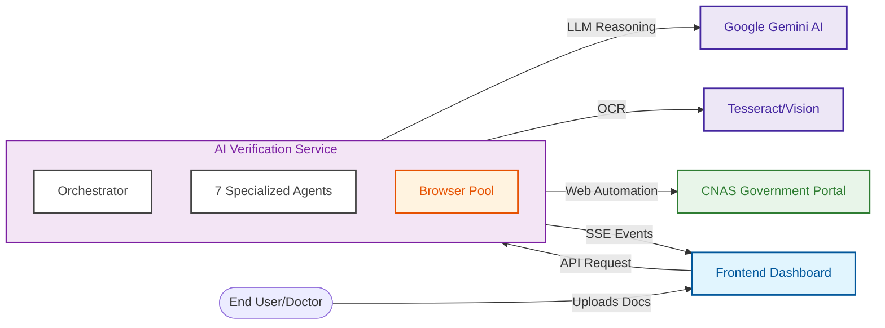
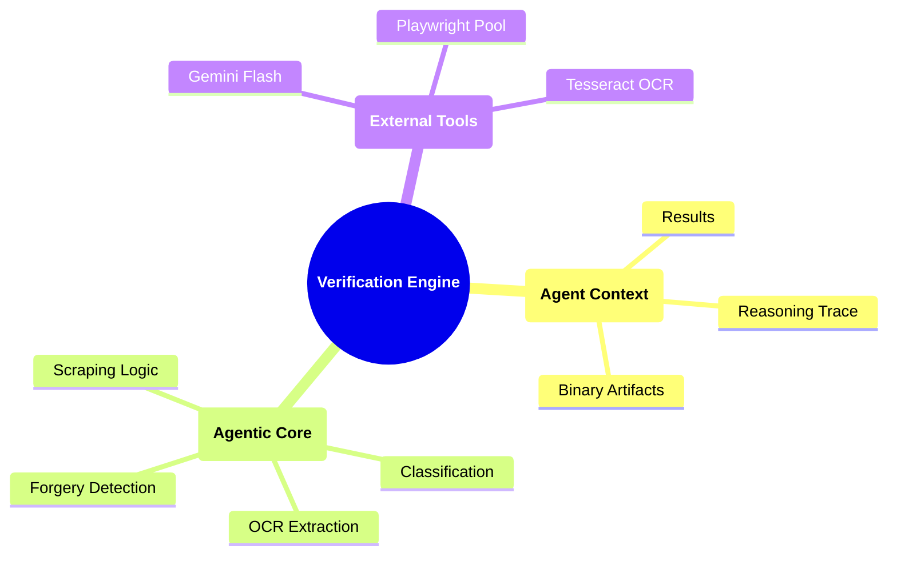

# Visual System Representation

This document provides a high-level visual perspective of the system's integration within the broader ecosystem.

## Ecosystem Block Diagram

## Internal Data Model (Mindmap)

The system uses a **Centralized Shared State** model. This is more resilient than a chain-link pipeline because agents can revisit previous decisions if new information becomes available.

## Why this Visualization Matters
This structure proves that the system is **decoupled**. We can swap out the OCR tool or the government portal URL without ever changing the Frontend logic or the core Orchestrator. It is built for the long-term evolution of the Algerian digital economy.
